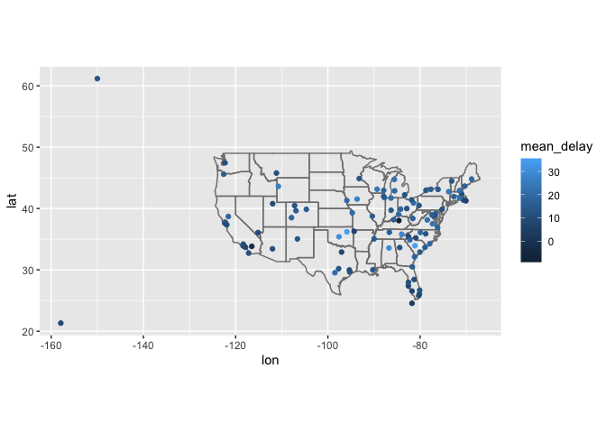

hw3
================
2022-10-12

``` r
library(dplyr)
```

    ## Warning: package 'dplyr' was built under R version 4.0.5

    ## 
    ## Attaching package: 'dplyr'

    ## The following objects are masked from 'package:stats':
    ## 
    ##     filter, lag

    ## The following objects are masked from 'package:base':
    ## 
    ##     intersect, setdiff, setequal, union

``` r
library(nycflights13)
library(ggplot2)
flights
```

    ## # A tibble: 336,776 × 19
    ##     year month   day dep_time sched_dep_time dep_delay arr_time sched_arr_time
    ##    <int> <int> <int>    <int>          <int>     <dbl>    <int>          <int>
    ##  1  2013     1     1      517            515         2      830            819
    ##  2  2013     1     1      533            529         4      850            830
    ##  3  2013     1     1      542            540         2      923            850
    ##  4  2013     1     1      544            545        -1     1004           1022
    ##  5  2013     1     1      554            600        -6      812            837
    ##  6  2013     1     1      554            558        -4      740            728
    ##  7  2013     1     1      555            600        -5      913            854
    ##  8  2013     1     1      557            600        -3      709            723
    ##  9  2013     1     1      557            600        -3      838            846
    ## 10  2013     1     1      558            600        -2      753            745
    ## # … with 336,766 more rows, and 11 more variables: arr_delay <dbl>,
    ## #   carrier <chr>, flight <int>, tailnum <chr>, origin <chr>, dest <chr>,
    ## #   air_time <dbl>, distance <dbl>, hour <dbl>, minute <dbl>, time_hour <dttm>

``` r
airports
```

    ## # A tibble: 1,458 × 8
    ##    faa   name                             lat    lon   alt    tz dst   tzone    
    ##    <chr> <chr>                          <dbl>  <dbl> <dbl> <dbl> <chr> <chr>    
    ##  1 04G   Lansdowne Airport               41.1  -80.6  1044    -5 A     America/…
    ##  2 06A   Moton Field Municipal Airport   32.5  -85.7   264    -6 A     America/…
    ##  3 06C   Schaumburg Regional             42.0  -88.1   801    -6 A     America/…
    ##  4 06N   Randall Airport                 41.4  -74.4   523    -5 A     America/…
    ##  5 09J   Jekyll Island Airport           31.1  -81.4    11    -5 A     America/…
    ##  6 0A9   Elizabethton Municipal Airport  36.4  -82.2  1593    -5 A     America/…
    ##  7 0G6   Williams County Airport         41.5  -84.5   730    -5 A     America/…
    ##  8 0G7   Finger Lakes Regional Airport   42.9  -76.8   492    -5 A     America/…
    ##  9 0P2   Shoestring Aviation Airfield    39.8  -76.6  1000    -5 U     America/…
    ## 10 0S9   Jefferson County Intl           48.1 -123.    108    -8 A     America/…
    ## # … with 1,448 more rows

``` r
colnames(flights)
```

    ##  [1] "year"           "month"          "day"            "dep_time"      
    ##  [5] "sched_dep_time" "dep_delay"      "arr_time"       "sched_arr_time"
    ##  [9] "arr_delay"      "carrier"        "flight"         "tailnum"       
    ## [13] "origin"         "dest"           "air_time"       "distance"      
    ## [17] "hour"           "minute"         "time_hour"

``` r
colnames(airports)
```

    ## [1] "faa"   "name"  "lat"   "lon"   "alt"   "tz"    "dst"   "tzone"

\#1

``` r
t1 = flights %>% 
  group_by(dest) %>% 
  summarise(mean_delay = mean(dep_delay, na.rm = T))
  


t2 = airports %>%
  semi_join(flights, c("faa" = "dest")) %>% 
  left_join(t1, by = c("faa" = "dest"))

ggplot(data = t2, aes(lon, lat, color = mean_delay)) +
  borders("state") +
  geom_point() +
  coord_quickmap()
```

<!-- -->

\#2

``` r
t3 = airports %>% 
  select("faa", "lat", "lon")

t4 = flights %>% 
  left_join(t3, by = c("dest" = "faa"))

print(t4)
```

    ## # A tibble: 336,776 × 21
    ##     year month   day dep_time sched_dep_time dep_delay arr_time sched_arr_time
    ##    <int> <int> <int>    <int>          <int>     <dbl>    <int>          <int>
    ##  1  2013     1     1      517            515         2      830            819
    ##  2  2013     1     1      533            529         4      850            830
    ##  3  2013     1     1      542            540         2      923            850
    ##  4  2013     1     1      544            545        -1     1004           1022
    ##  5  2013     1     1      554            600        -6      812            837
    ##  6  2013     1     1      554            558        -4      740            728
    ##  7  2013     1     1      555            600        -5      913            854
    ##  8  2013     1     1      557            600        -3      709            723
    ##  9  2013     1     1      557            600        -3      838            846
    ## 10  2013     1     1      558            600        -2      753            745
    ## # … with 336,766 more rows, and 13 more variables: arr_delay <dbl>,
    ## #   carrier <chr>, flight <int>, tailnum <chr>, origin <chr>, dest <chr>,
    ## #   air_time <dbl>, distance <dbl>, hour <dbl>, minute <dbl>, time_hour <dttm>,
    ## #   lat <dbl>, lon <dbl>

\#3

``` r
t5 = planes %>% 
  select("tailnum", "year")

t6 = flights %>% 
  semi_join(planes,by = "tailnum") %>% 
  left_join(t5, by = "tailnum") %>% 
  group_by(year.y) %>% 
  summarise(mean_delay = mean(dep_delay, na.rm = T))

ggplot(data = t6, aes(x = year.y, y = mean_delay))+
  geom_point()
```

    ## Warning: Removed 1 rows containing missing values (geom_point).

<!-- -->

\#Before year 1980 there is no clear pattern. From 1980 to about 2000,
there is a positive correlation between the age of plane and its delay.
From 2000 to current year, there is a negative correlation between the
age of plane and its delay.
